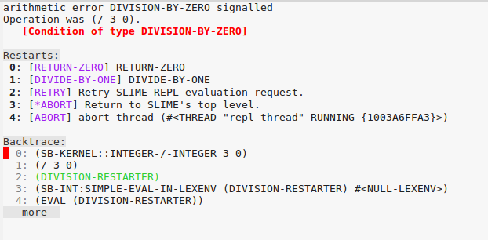
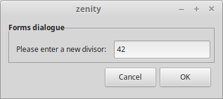

---
title: 错误及异常处理
---

Common Lisp 也和其他语言一样有错误及异常处理（Condition）的机制，而且比其他的语言做的更好。

什么是异常？

> Just like in languages that support exception handling (Java, C++,
> Python, etc.), a condition represents, for the most part, an
> “exceptional” situation. However, even more so that those languages,
> *a condition in Common Lisp can represent a general situation where
> some branching in program logic needs to take place*, not
> necessarily due to some error condition. Due to the highly
> interactive nature of Lisp development (the Lisp image in
> conjunction with the REPL), this makes perfect sense in a language
> like Lisp rather than say, a language like Java or even Python,
> which has a very primitive REPL. In most cases, however, we may not
> need (or even allow) the interactivity that this system offers
> us. Thankfully, the same system works just as well even in
> non-interactive mode.
>
> [z0ltan](https://z0ltan.wordpress.com/2016/08/06/conditions-and-restarts-in-common-lisp/)

现在来一步步来讲解介绍把。


## 忽略所有的错误，并返回 nil

有时候你明确的知道所调用的函数会出错，但是这个错误无关紧要，就可以使用 `[ignore-errors][ignore-errors]` 来忽略：

~~~lisp
(ignore-errors
  (/ 3 0))
; in: IGNORE-ERRORS (/ 3 0)
;     (/ 3 0)
;
; caught STYLE-WARNING:
;   Lisp error during constant folding:
;   arithmetic error DIVISION-BY-ZERO signalled
;   Operation was (/ 3 0).
;
; compilation unit finished
;   caught 1 STYLE-WARNING condition
NIL
#<DIVISION-BY-ZERO {1008FF5F13}>
~~~
以上的代码会得到 `division-by-zero` 的警告，但是代码依然可以完整的运行并返回：`nil` 和 错误的信号。返回值是无法改变的。

记住，在 Slime 中可以使用鼠标右击来 `插入(inspect）` 异常状态的条件。


## 捕获任意异常（handler-case）

<!-- we will say "handling" for handler-bind -->

`ignore-errors` 集成在 [handler-case][handler-case]。可以将上面的例子修改成以下的代码，然后返回所需要的结果：

~~~lisp
(handler-case (/ 3 0)
  (error (c)
    (format t "We caught a condition.~&")
    (values 0 c)))
; in: HANDLER-CASE (/ 3 0)
;     (/ 3 0)
;
; caught STYLE-WARNING:
;   Lisp error during constant folding:
;   Condition DIVISION-BY-ZERO was signalled.
;
; compilation unit finished
;   caught 1 STYLE-WARNING condition
We caught a condition.
0
#<DIVISION-BY-ZERO {1004846AE3}>
~~~

这个也返回了两个值，0 和 异常结果。

`handler-case` 的通用格式是：

~~~lisp
(handler-case (code that errors out)
   (condition-type (the-condition) ;; <-- optional argument
      (code))
   (another-condition (the-condition)
       ...))
~~~

也可以像 `cond` 中匹配 `t` 一样匹配一些异常：

~~~lisp
(handler-case
    (progn
      (format t "This won't work…~%")
      (/ 3 0))
  (t (c)
    (format t "Got an exception: ~a~%" c)
    (values 0 c)))
;; …
;; This won't work…
;; Got an exception: arithmetic error DIVISION-BY-ZERO signalled
;; Operation was (/ 3 0).
;; 0
;; #<DIVISION-BY-ZERO {100608F0F3}>
~~~


## 捕获特定的异常

~~~lisp
(handler-case (/ 3 0)
  (division-by-zero (c)
    (format t "Caught division by zero: ~a~%" c)))
;; …
;; Caught division by zero: arithmetic error DIVISION-BY-ZERO signalled
;; Operation was (/ 3 0).
;; NIL
~~~

以上的工作流和其他语言中的 try/catch 很想，但是在 Lisp 中可以做的更多。


## handler-case VS handler-bind

`handler-case` 类似于 `try/catch`。

[handler-bind][handler-bind] （下面例子中会使用） 是当异常信号抛出时完全进行控制的。他可以使用 调试器和重启器，无论是交互时还是已经编程好了的。

当某些库无法捕获所有的异常并造成困恼时，可以使用 restarts (通过建立 `restart-case`) 来查看栈中的状态，包括该库调用的其他的库的 restart。然后就可以对栈中的信息进行追踪，在某些lisp中，甚至可以查看到局部变量等信息。一旦使用 `handler-case`，“忘了”这点的话，所以的问题都会解决。`handler-bind` 不支持重定位栈。

在介绍 `handler-bind` 前，先来看看 conditions 和 restarts 吧。


## 定义和处理异常

[define-condition][define-condition]，[make-condition][make-condition].

~~~lisp
(define-condition my-division-by-zero (error)
  ())

(make-condition 'my-division-by-zero)
;; #<MY-DIVISION-BY-ZERO {1005A5FE43}>
~~~

在创建异常时提供一些信息会让这个异常更加方便使用：

~~~lisp
(define-condition my-division-by-zero (error)
  ((dividend :initarg :dividend
             :initform nil
             :reader dividend)) ;; <-- we'll get the dividend with (dividend condition). See the CLOS tutorial if needed.
  (:documentation "Custom error when we encounter a division by zero.")) ;; good practice ;)
~~~

这样，就可以抛出异常并将信息显示出来。

~~~lisp
(make-condition 'my-division-by-zero :dividend 3)
;; #<MY-DIVISION-BY-ZERO {1005C18653}>
~~~

注，以下是 [Common Lisp Object System](clos.html) 中的一个简单的使用方法：

~~~lisp
(make-condition 'my-division-by-zero :dividend 3)
;;                                   ^^ this is the ":initarg"
~~~

`:reader dividend` 生成一个通用函数，该函数是 `my-division-by-zero` 对象的一个 "getter"。

~~~lisp
(make-condition 'my-division-by-zero :dividend 3)
;; #<MY-DIVISION-BY-ZERO {1005C18653}>
(dividend *)
;; 3
~~~

":accessor" 既是 getter 也是 setter.

因此，`define-condition` 的一般格式看起来想类的定义，但要区分一下，异常不是单独的对象。

区别是无法使用 `slot-value`

## 抛出异常： error, warn, signal

[error][error] 的两种用法:

- `(error "some text")`：抛出 [simple-error][simple-error] 异常，然后打开解释器的debugger。
- `(error 'my-error :message "We did this and that and it didn't work.")`：创建并抛出自定义的异常，然后打开解释器的debugger。

~~~lisp
(error 'my-division-by-zero :dividend 3)
;; which is a shortcut for
(error (make-condition 'my-division-by-zero :dividend 3))
~~~

`warn` 不会打开 debugger (create warning conditions by subclassing [simple-warning][simple-warning]).

[signal][signal] 进入debugger，同时抛出一个上层的异常。

这个可以用在任何地方。比如说，可以在操作是来追踪一个进程。也可以创建个带有 `percent` 的异常，并在进程创建时抛出，让后通过上层的代码进行处理显示出来。

### 异常继承

`simple-error` 的子类有 `simple-error, simple-condition, error, serious-condition, condition, t`.

`simple-warning` 的子类有  `simple-warning, simple-condition, warning, condition, t`.


### 自定义错误信息(:report)

到目前位置，抛出自定义的错误时，会在 debugger 中见到如下的信息：

```
Condition COMMON-LISP-USER::MY-DIVISION-BY-ZERO was signalled.
   [Condition of type MY-DIVISION-BY-ZERO]
```

可以通过 `:report` 这个函数在异常的定义中定义更详细的信息：

~~~lisp
(define-condition my-division-by-zero (error)
  ((dividend :initarg :dividend
             :initform nil
             :accessor dividend))
  ;; the :report is the message into the debugger:
  (:report (lambda (condition stream)
     (format stream "You were going to divide ~a by zero.~&" (dividend condition)))))
~~~

现在的话

~~~lisp
(error 'my-division-by-zero :dividend 3)
;; Debugger:
;;
;; You were going to divide 3 by zero.
;;    [Condition of type MY-DIVISION-BY-ZERO]
~~~


## Inspecting the stacktrace

另一个小提示，不是 Slime 的教程。可以在 debugger 中插入一些栈追踪，函数调用的参数，跳转到出错的代码行 通过 `v` 键，执行代码，`e` 键等等。

通常，你可以编辑一个有bug的函数，编译（`C-c C-c`），然后选择 "RETRY" 来重现代码的执行。

以上的都是基于编译器。

更多信息参见 [debugging section](debugging.html).


# Restarts, interactive choices in the debugger

Restart 是在 debugger 中的一些选择，通常是有 `RETRY` 和 `ABORT`。

在处理 restarts 时，可以认为不会出错时进行操作。


## 使用断言中的 optional restart

`assert` 最简单的格式如下：

~~~lisp
(assert (realp 3))
;; NIL = passed
~~~

当断言失败时，可以在 debugger 中输出如下信息：

~~~lisp
(defun divide (x y)
  (assert (not (zerop y)))
  (/ x y))

(divide 3 0)
;; The assertion (NOT #1=(ZEROP Y)) failed with #1# = T.
;;    [Condition of type SIMPLE-ERROR]
;;
;; Restarts:
;;  0: [CONTINUE] Retry assertion.
;;  1: [RETRY] Retry SLIME REPL evaluation request.
;;  …
~~~

也接受参数来修改值：

~~~lisp
(defun divide (x y)
  (assert (not (zerop y))
          (y)   ;; list of values that we can change.
          "Y can not be zero. Please change it") ;; custom error message.
  (/ x y))
~~~

现在，得到了一个新的 restart，并且可以修改 Y 的值：

~~~lisp
(divide 3 0)
;; Y can not be zero. Please change it
;;    [Condition of type SIMPLE-ERROR]
;;
;; Restarts:
;;  0: [CONTINUE] Retry assertion with new value for Y.  <--- new restart
;;  1: [RETRY] Retry SLIME REPL evaluation request.
;;  …
~~~
当选定时，会有个新的值在 REPL 中输出：

```
The old value of Y is 0.
Do you want to supply a new value?  (y or n) y

Type a form to be evaluated:
2
3/2  ;; and our result.
```


## 定义 restarts (restart-case)

[restart-case][restart-case].

~~~lisp
(defun divide-with-restarts (x y)
  (restart-case (/ x y)
    (return-zero ()  ;; <-- creates a new restart called "RETURN-ZERO"
      0)
    (divide-by-one ()
      (/ x 1))))
(divide-with-restarts 3 0)
~~~

在每个错误中，最上面都会有以下两个选择：



好吧，现在开始写一些可多性更高的 “reports” 吧：

~~~lisp
(defun divide-with-restarts (x y)
  (restart-case (/ x y)
    (return-zero ()
      :report "Return 0"  ;; <-- added
      0)
    (divide-by-one ()
      :report "Divide by 1"
      (/ x 1))))
(divide-with-restarts 3 0)
;; Nicer restarts:
;;  0: [RETURN-ZERO] Return 0
;;  1: [DIVIDE-BY-ONE] Divide by 1
~~~

这样就好多了，但是不能像 `assert` 中的例子那样修改操作符。


## 在 restarts 中修改变量的值

以上定义的 restarts 并不会去接受新的值。为了实现这步，可以在 restart 中添加一个 `:interactive` 的 lambda 函数，用来获取一个新的值。在这，将使用 `read`。

~~~lisp
(defun divide-with-restarts (x y)
  (restart-case (/ x y)
    (return-zero ()
      :report "Return 0"
      0)
    (divide-by-one ()
      :report "Divide by 1"
      (/ x 1))
    (set-new-divisor (value)
      :report "Enter a new divisor"
      ;;
      ;; Ask the user for a new value:
      :interactive (lambda () (prompt-new-value "Please enter a new divisor: "))
      ;;
      ;; and call the divide function with the new value…
      ;; … possibly catching bad input again!
      (divide-with-restarts x value))))

(defun prompt-new-value (prompt)
  (format *query-io* prompt)  ;; *query-io*: the special stream to make user queries.
  (force-output *query-io*)   ;; Ensure the user sees what he types.
  (list (read *query-io*)))   ;; We must return a list.

(divide-with-restarts 3 0)
~~~

调用时，会产生新的 restart，然后输入一个值，就会得到相应的结果：

~~~
(divide-with-restarts 3 0)
;; Debugger:
;;
;; 2: [SET-NEW-DIVISOR] Enter a new divisor
;;
;; Please enter a new divisor: 10
;;
;; 3/10
~~~

噢，你个倾向于使用图形界面？那就用 `zenity` （GNU/Linux环境中）吧：

~~~lisp
(defun prompt-new-value (prompt)
  (list
   (let ((input
          ;; We capture the program's output to a string.
          (with-output-to-string (s)
            (let* ((*standard-output* s))
              (uiop:run-program `("zenity"
                                  "--forms"
                                  ,(format nil "--add-entry=~a" prompt))
                                :output s)))))
     ;; We get a string and we want a number.
     ;; We could also use parse-integer, the parse-number library, etc.
     (read-from-string input))))
~~~

在运行一次，你就可以得到如下的图片了：



有趣吧，但这还不是全部。手动去选择 restarts 并不能满足需求。

## 自动调用 restarts (handler-bind, invoke-restart)

现在有一小段代码可以抛出异常，但是如果需要在更高层会自动的去处理这个异常并调用合适的 restart。那么就需要用到 `handler-bind` 和 [invoke-restart][invoke-restart]:

~~~lisp
(defun divide-and-handle-error (x y)
  (handler-bind
      ((division-by-zero (lambda (c)
                (format t "Got error: ~a~%" c) ;; error-message
                (format t "and will divide by 1~&")
                (invoke-restart 'divide-by-one))))
    (divide-with-restarts x y)))

(divide-and-handle-error 3 0)
;; Got error: arithmetic error DIVISION-BY-ZERO signalled
;; Operation was (/ 3 0).
;; and will divide by 1
;; 3
~~~


## restarts 的其他用法 (find-restart)

[find-restart][find-restart].

`find-restart 'name-of-restart` 返回对应的 restart 或 `nil`。


## 显示/隐藏 restarts

可以将 restarts 进行隐藏的，在 `restart-case` 中，除了 `:report`
和 `:interactive`，也接受 `:test` 关键词：

~~~lisp
(restart-case
   (return-zero ()
     :test (lambda ()
             (some-test))
    ...
~~~


# 处理 conditions (handler-bind)

[handler-bind][handler-bind]

~~~lisp
(handler-bind ((a-condition #'function-to-handle-it)
               (another-one #'another-function))
    (code that can...)
    (...error out))
~~~

可以通过 [`unix-opts`](https://github.com/mrkkrp/unix-opts) 库来进行讲解：

~~~lisp
(handler-bind ((opts:unknown-option #'unknown-option)
               (opts:missing-arg #'missing-arg)
               (opts:arg-parser-failed #'arg-parser-failed))
  (opts:get-opts))
~~~

自定义的 `unknown-option` 如下：

~~~lisp
(defun unknown-option (condition)
  (format t "~s option is unknown.~%" (opts:option condition))
  (opts:describe)
  (exit)) ;; <-- we return to the command line, no debugger.
~~~

接受异常作为参数，因此，可以获取所需要的信息。

# 执行代码， condition or not ("finally") (unwind-protect)

`try/catch/finally` 中 “finally” 的部分是由 [unwind-protect][unwind-protect] 实现。

与 `with-open-file` 的宏类似，结束后会自动关闭文件：

~~~lisp
(unwind-protect (/ 3 0)
  (format t "This place is safe.~&"))
~~~

以上代码弹出交互的 debugger，但之后会输出相对应的信息。


## Resources

* [Practical Common Lisp: "Beyond Exception Handling: Conditions and Restarts"](http://gigamonkeys.com/book/beyond-exception-handling-conditions-and-restarts.html) - the go-to tutorial, more explanations and primitives.
* Common Lisp Recipes, chap. 12, by E. Weitz
* [language reference](https://www.cs.cmu.edu/Groups/AI/html/cltl/clm/node317.html)
* [Video tutorial: introduction on conditions and restarts](http://nklein.com/2011/03/tutorial-introduction-to-conditions-and-restarts/), by Patrick Stein.
* [Condition Handling in the Lisp family of languages](http://www.nhplace.com/kent/Papers/Condition-Handling-2001.html)
* [z0ltan.wordpress.com](https://z0ltan.wordpress.com/2016/08/06/conditions-and-restarts-in-common-lisp/) (the article this recipe is heavily based upon)

## See also

* [Algebraic effects - You can touch this !](http://jacek.zlydach.pl/blog/2019-07-24-algebraic-effects-you-can-touch-this.html) - how to use conditions and restarts to implement progress reporting and aborting of a long-running calculation, possibly in an interactive or GUI context.
* [A tutorial on conditions and restarts](https://github.com/stylewarning/lisp-random/blob/master/talks/4may19/root.lisp),  based around computing the roots of a real function. It was presented by the author at a Bay Area Julia meetup on may 2019 ([talk slides here](https://github.com/stylewarning/talks/blob/master/4may19-julia-meetup/Bay%20Area%20Julia%20Users%20Meetup%20-%204%20May%202019.pdf)).
* [lisper.in](https://lisper.in/restarts#signaling-validation-errors) - example with parsing a csv file and using restarts with success, [in a flight travel company](https://www.reddit.com/r/lisp/comments/7k85sf/a_tutorial_on_conditions_and_restarts/drceozm/).
* [https://github.com/svetlyak40wt/python-cl-conditions](https://github.com/svetlyak40wt/python-cl-conditions) - implementation of the CL conditions system in Python.

[ignore-errors]: http://www.lispworks.com/documentation/HyperSpec/Body/m_ignore.htm
[handler-case]: http://www.lispworks.com/documentation/HyperSpec/Body/m_hand_1.htm
[handler-bind]: http://www.lispworks.com/documentation/HyperSpec/Body/m_handle.htm
[define-condition]: http://www.lispworks.com/documentation/HyperSpec/Body/m_defi_5.htm
[make-condition]: http://www.lispworks.com/documentation/HyperSpec/Body/f_mk_cnd.htm
[error]: http://www.lispworks.com/documentation/HyperSpec/Body/e_error.htm#error
[simple-error]: http://www.lispworks.com/documentation/HyperSpec/Body/e_smp_er.htm
[simple-warning]: http://www.lispworks.com/documentation/HyperSpec/Body/e_smp_wa.htm
[signal]: http://www.lispworks.com/documentation/HyperSpec/Body/f_signal.htm
[restart-case]: http://www.lispworks.com/documentation/HyperSpec/Body/m_rst_ca.htm
[invoke-restart]: http://www.lispworks.com/documentation/HyperSpec/Body/f_invo_1.htm#invoke-restart
[find-restart]: http://www.lispworks.com/documentation/HyperSpec/Body/f_find_r.htm#find-restart
[unwind-protect]: http://www.lispworks.com/documentation/HyperSpec/Body/s_unwind.htm
