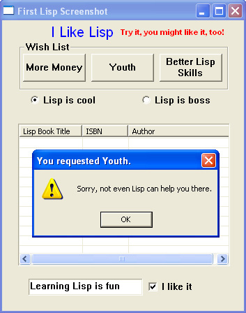

## 概述及适用范围

本章介绍了Win32 API的基础知识，演示了在 Lisp 怎么调用 Win32 API，并展示了如何使用 Lisp 创建强大的 Win32编程环境，这个环境可以针对特定的应用进行优化。。像这样的 Lisp 环境在 Win32 API 显示的每个选项都至少要和 Win32 API 一样复杂。然而，很难想象一个给定的应用程序域需要 Win32 API 中所有函数的选项。以指定域的方法扩展 Lisp 的语法可以将其中多余 Win32 API 部分隐藏起来。（大部分 Win32 API 都会被隐藏）。之后，程序员只需要处理和思考当前任务要用到的 API 就可以。后面要用的 Win32 API 随时都可以再简单的显示出来。

单个环境同时针简单和复杂应用进行优化时比较复杂。本章中概述的方法能够构建简单到复杂到环境，适用于各种应用领域。

本章的开头介绍了一些概念和想法，最后会以 “Hello” 程序结束:

~~~lisp
(require "win-header")
(in-package :wh)
(export '(initialize-appendix-b))

(DefMsgHandler appendix-b-proc MsgMap ()
               (WM_PAINT
                (text-out "Hello from Lisp!" 0 0 :color (RGB 0 0 255))
                0))

(defun initialize-appendix-b ()
  (DefActiveTopWindow "Hello" 'appendix-b-proc
    :style ws_overlappedwindow :width 150 :height 200 :title "Hello Program"))
~~~

其中 Lispworks 是 Windows 版的，版本为 4.2.7。（个人版可以免费下载哟）。并没有去尝试其他的 Lisp 解释器，也没有考虑平台的兼容性。在本章的一些章节中会说明，同时决定使用 Lispworks 是因为：

* 发行早且更新频繁。缩小范围就符合这个哲学。之后可能会加入其他的 Lisp 的解释器实现。[Corman Lisp](http://www.cormanlisp.com) 包含了很多 Win32 API 的功能。但本人并没有使用过其他发行的 Lisp 解释器，也没有去尝试过。
* 本章重的一些应用在其他 Lisp 的解释器上也适用。这不过是外部语言的接口不一样，Win32 还是一样的。

也欢迎其他人来一起扩大 Win32（或其他）领域的覆盖面。

Win32 API 编程的人都要熟悉 由 Charles Petzold 写的 [Programming Windows, The Definitive Guide to the Win32 API](http://www.charlespetzold.com/pw5/index.html) 或是类似的书。

本章的代码只在 Windows XP Lispworks 个人版 4.2.7 上验证过。

## 原因

如果一个程序可以是跨平台，那么就应该是跨平台。Common Lisp 中的 _Common_ 指的就是跨平台、跨编译器，这是Common Lisp 本质。这种可移植性优势不容忽视。但没有 Lisp 的强大功能的话，以不可移植的方式编程，来利用 Win32 API 就没有这个必要。

有人可能会关注 Lisp 的执行文件太大。Windows 是用 C 和 C++ 开发出来的。C/C++ 程序的依赖库是由操作系统提供。Lisp 程序运行时的依赖看起来很大，这只是因为操作系统没有提供这些依赖。在交付模式下部署 Lisp 程序完全没有问题，尤其是对于 Windows 版本的 Lispworks，不需要任何版税，就可以一次性交付运行时的程序，然后再交付大小比较小的的编译程序。

如果需要创建适合大量公共下载的小程序，那么 Lisp 运行的依赖在大部分计算机上不加载就是个限制。但是，Windows 版的 Lispworks 可以在交付阶段进行适当的裁剪，有时可以将程序可以缩小到 2MB 以下，这适用于很多下载情况。需要完整 Lisp 运行的情况一般是大型应用，在这些应用程序中，通过 CD 或一次性下载是有用的，之后交付单独编译的组件，这些组件是在程序或组件初始化期间加载的。

我的理解是，最终程序大小的下限并不是 Lisp 所固有的，而只是当前市场需求的结果。随着市场对 Lisp 编写的小程序需求的增长，开发上将会花时间开发更好的裁剪工具。(Lisp 刚开始是会有大量代码，之后可以删除与产品无关的代码，而 C/C++ 开始时代码比较少，但会随着需求的增加而增加。Lisp 从 REPL 开始，一个读取，计算求值、打印的循环，充分利用了 Lisp 强大的交互功能）。

乍一看 Lispwork 的外部语言界面（FLI）可能会有些奇怪。操作系统是用 C/C++ 开发的，因此在 C/C++ 进行系统调用不是外部调用，就像在 Lisp 函数中调用 Lisp 函数不能叫做外部调用一样。

## Win32 程序生命周期简述

操作系统将 Win32 GUI 程序当作是一系列子任务或函数：

* 第一个函数是 —— WinMain，程序初始化时调用该函数
* WinMain 回调用 RegisterClass 函数，RegisterClass 会通知系统回调函数的位置。RegisterClass会同时调用多个函数，但其中只有一个是回调函数，提供给应用的主窗口。RegisterClass 运行完成后，系统就知道新定义的类了。
* 之后是调用函数 CreateWindowEx，该函数会接收 RegisterClass 给出的类名。现在窗口已经创建了，可不可见就取决与传给 CreateWindowsEx 的参数。
* 然后系统开始对新创建窗口的相关消息进行排队，该队列会保存下来然后传给 WinMain 函数。
* 函数 WinMain 会有个类似与 _message pump_ 的循环来读取消息队列。这个消息读取循环叫 GetMessage、TranslateMessage 以及 DispatchMessage。
* GetMessage 会从队列中获取一条消息。消息队列的排序有一定的方法和可靠性。例如，创建窗口时，会有确定序列的消息队列会进入队列。像移动鼠标这样的事件会产生新的队列
* TranslateMessage 会把虚拟按键消息转换为字符消息。DispatchMessage 会请求系统处理消息。之后系统会调用程序中其他的子任务或函数来处理消息。被调用的程序函数是在 RegisterClass 中指定的函数，其中包括一个类名参数，其中这个类名是由 CreateWindowEx 指定。
* RegisterClass 中指定的程序函数的参数有四个：
    1. 处理相关消息的 handle
    2. 消息 id，整型。
    3. wParam，无符号长整型
    4. lParam，无符号长整型
* wParam 和 lParam 的语义绝大程度取决于消息 id
* 程序函数中有个等价于 case 的语句，用来判断消息 id。有成千上百个消息 id。通用的包括 vm_create（窗口创建时发出），wm_paint（窗口内容显示时发出），wm_destory(窗口关闭时发出)。其他的消息是为相应按键、移动鼠标和鼠标单击等事件而生成的。也有显示摄像头的视频、捕捉或播放声音文件、拨打电话等相关的 windows 消息。在操作系统中有数千条这样的消息，但程序通常只处理其中的一小部分。当函数收到无法处理的消息时，这个消息会传给 Win32 默认函数。
* 当菜单命令或其他事件导致程序调用 PostQuitMessage 时，GetMessage 会返回 0，这是退出消息泵循环的信号。然后 WinMain 退出，程序结束。

## Lisp 和 Windows 编码系统

微软部分操作系统使用单字节（ASCII）字符集，其他的使用的是双字节（Unicode）的字符集。

~~~lisp
(defun external-format ()
  (if (string= (software-type) "Windows NT")
      :unicode
    :ascii)
~~~

上面代码可以检查到底是用的哪种字符集。Win32 函数接受和返回字符/字符串有两种形式：1）以 A 结尾的ASCII字符，2）以 W 结尾的 Unicode 字符。这个外部格式的函数主要在调用 `fli:with-foreign-string` 时有用，这个函数是Lispworks 外部函数接口。在外函数接口或 FLI 中定义 Win32 函数时，关键字 ：dbcs 表名函数同时兼容单字节和双字节。有 :dbcs 时，Windows 95 上 Lispworks 会在函数名后加个 "A"，在 Windows NT/2000/XP 上 Lispworks 会在函数名后价格 “W”。(本人是在 Windows XP 下编写并测试了示例程序（参见附录A）。）没有 :dbcs 的话，Lispworks 不会修改外部函数名。

Win32 TextOut 函数的 FLI 定义：

~~~lisp
(fli:define-foreign-function
    (TextOut "TextOut" :dbcs :calling-convention :stdcall)
    ((HDC (:unsigned :long)) (nXStart (:unsigned :int)) (nYStart (:unsigned :int))
     (lpString :pointer) (cbString (:unsigned :int)))
  :result-type (:unsigned :long))
~~~

等价于 NT/2000/XP 下的：

~~~lisp
(fli:define-foreign-function
    (TextOut "TextOutW" :calling-convention :stdcall)
    ((HDC (:unsigned :long)) (nXStart (:unsigned :int)) (nYStart (:unsigned :int))
     (lpString :pointer) (cbString (:unsigned :int)))
  :result-type (:unsigned :long))
~~~

第二个中是在 95 下使用 “TextOutA”。

为了说明这个，先用个看点的 FLI 的例子来讲解吧，此例是演示用的，使用简单。我们只是想确认操作系统是否能运行给定 Win32 函数。在下面的 REPL 中，只有调用Lisp重启处理程序时，返回的结果才重要。当没有调用重启处理程序时，就会找到、加载并调用Win32函数。调用 FLI 中不存在的 Win32 函数时，会启动 restart。（textout 的define-foreign-function 定义在[附录A](#appendixa)中）。

~~~lisp
CL-USER 9 > (fli:define-foreign-function
                (TextOut-1 "TextOut" :dbcs :calling-convention :stdcall)
                () :result-type :int)
TEXTOUT-1

CL-USER 10 > (textout-1)
1

CL-USER 11 > (fli:define-foreign-function
                 (TextOut-2 "TextOut" :dbcs :calling-convention :stdcall)
                 () :result-type :int)
TEXTOUT-2

CL-USER 12 > (textout-2)
0
~~~

`TextOut` 在上面 FLI 定义中都有。上面的代码表示一个给定的 Win32 函数可以在多个 FLI 定义中命名。当多个 Lisp 数据类型可以满足 Wind32 函数的参数时，这个技术就比较实用了。

~~~lisp
CL-USER 13 > (fli:define-foreign-function
                 (TextOut-3 "TextOutW" :dbcs :calling-convention :stdcall)
                 () :result-type :int)

TEXTOUT-3

CL-USER 14 > (textout-3)

Error: Foreign function TEXTOUT-3 trying to call to unresolved
external function "TextOutWW".

1 (abort) Return to level 0.
2 Return to top-level loop.
3 Return from multiprocessing.

Type :b for backtrace, :c  to proceed,  or :? for other
options

CL-USER 15 : 1 > :top

CL-USER 16 > (fli:define-foreign-function
                 (TextOut-4 "TextOutW" :calling-convention :stdcall)
                 () :result-type :int)

TEXTOUT-4

CL-USER 17 > (textout-4)
1

CL-USER 18 > (fli:define-foreign-function
                 (TextOut-5 "TextOutA" :calling-convention :stdcall)
                 () :result-type :int)
TEXTOUT-5

CL-USER 19 > (textout-5)
0

CL-USER 20 >
~~~

上面省略了在定义多个外部函数后 Lispworks 给出的警告，这是因为之前的定义对 :dbcs 关键字的用法与当前定义不同。在 CL-USER 14 之后，Lispworks 会报“TextOutWW” 错，这说明 :dbcs 关键字会让 Lispworks 在外部函数名后加上 “W”，尽管外部函数的存在要到实际调用时才能验证。TextOut-5 确认 TextOutA 是否存在，是 TextOut 的ASCII 版。

在标题和其他地方看到奇怪的字符集时，可以统一使用 :dbcs 的 W/A声明来能够解决。

Edi Weitz 提出 :dbcs 关键字是在编译时或运行时到底会调用那个函数， A 还是 W 呢？答案在下面例子中：

~~~lisp
(in-package :cl-user)

(fli:define-foreign-function
    (MessageBox "MessageBox" :dbcs :calling-convention :stdcall)
    ((hwnd (:unsigned :long)) (text (:unsigned :long)) (title (:unsigned :long)) (flags (:unsigned :long)))
  :result-type (:unsigned :long))

(defun external-format ()
  (if (string= (software-type) "Windows NT")
      :unicode
      :ascii))

(defun display-format-used ()
  (fli:with-foreign-string
      (unicode-p u-ec u-bc :external-format (external-format)) "Unicode"
      (fli:with-foreign-string
	  (ascii-p a-ec a-bc :external-format (external-format)) "Ascii"
	  (fli:with-foreign-string
              (title-p t-ec t-bc :external-format (external-format)) "External Format"
              (if (eq (external-format) :unicode)
                  (messagebox 0 (fli:pointer-address unicode-p)
                              (fli:pointer-address title-p) 0)
                  (messagebox 0 (fli:pointer-address ascii-p)
                              (fli:pointer-address title-p) 0))))))

(compile 'external-format)
(compile 'display-format-used)

(deliver 'display-format-used "dbcs-run" 5)
(quit)

; We then have dbcs-run.exe.  When run on Windows XP, dbcs-run pops up a messagebox
; displaying "Unicode".  The same dbcs-run.exe file, ftp'd to a Macintosh running OS 9 with
; Virtual PC running Windows 98, pops up a message box displaying "Ascii".
~~~

## FLI - 外部语言接口 - 将 C 语言头文件转换成 Lisp

在 C/C+ 中，调用头文件都是通过 `#include` 语句完成。头文件包含了常量的定义、结构体定义以及函数接口。这些定义在 Lisp 也要能使用。然后我发现手动进行这种转换最直接。虽然有自动化的方法，但在每个函数的基础上手动完成也花不了多少时间。

在 C/C++ 中，`#define` 是在预处理器中。目标代码中只有 `define` 的才会被程序使用。在 Lisp 中，`defconstants` 都会加载到 Lisp 镜像中，不论之后会不会用到。关于这个问题我也没有确切的解决办法。

同时，我写了个基础或者说是核心的 win-header.lisp 文件，并使用其他 .lisp 文件（按功能分组），对于不常用的定义，只有在需要时才会加载这些 .lisp 文件。

### FLI 数据类型

Win32 的 C/C++ 头文件中包含了很多系统特定的数据结构的 typedef，有 HINSTANCE、HANDLE、HMENU、LPCTSTR等。对 Lisp 来说，这些本质上可以分为有符号和无符号、长整型或是字符型、单例或数组，或者是由这些类型组成的 C 结构。（int 和 long 似乎一样）。

Lisp 不懂或者说不在意 HINSTANCE 和 HMENU 之间的差别，反正都是简单的 32 为的值。只有在以下两种时候 Lisp 才会关心这些值的不同：1）将 Lisp 数据移到外部字段去 2）将外部数据移到 Lisp 中。当试图进行不正确的转换时，比如将负数放到无符号字段中，Lispworks 会进行强制转换结果。如果给了 Lisp 更多的类型提示，比如说声明一个外域字段为 :pointer （指针），当把 0 存入这个指针时，Lisp 会发出警告。但给操作系统传个空指针时不会报警。因此，我发现将大部分参数设为 long 会简单些，尽管我不时违反这个规则。

Lispworks FLI 的指针实际上是一个 Lisp 结构，这个结构包含了访问地址，或是未绑定，可以通过 `fli:pointer-address` 进行绑定。当把指针值传给系统时，比如说把 `RECT` 的地址传给 `GetClientRect`，需要进行两个步骤：1）为外域结构申请内存空间 2）将申请好的空间地址传给操作系统。大多数情况下，可以在 `fli:with-dynamic-foreign-objects` 中调用 `fli:allocate-dynamic-foreign-object` 进行内存申请，这样就不需要关注之后的内存销毁。使用 `fli:pointer-address`（没有绑定指针值）传递申请内存空间的地址并将外域函数的参数字段定义为无符号长整型。

FLI 可以定义这样的东西，比如说，Lispworks 会进行自动强制（解绑）。试试将参数类型定义为 :pointer。但是，当传一个空指针时，Lispworks 会发出警告，尽管我没有创建过地址为 0 的 FLI 指针。我选择的方法是，将指针定义为长整型，这样两个方向（系统到 Lisp，Lisp 到系统）都能正常运行。这可能只是我目前缺乏完全理解的结果，也许还有更好的方法。

相关的是在 C 结构体中定义数组比较有帮助，特别是在 `sPAINTSTRUCT` 中。这是可行的，但我不喜欢在当前的方法中获取结构成员的地址或是数组的首地址。我可以自己手动计算字节的偏移量，像下面这样：

~~~lisp
(defun interior-copy (to-struct-ptr byte-offset src-ptr)
  (let ((ptr (fli:make-pointer
              :address (fli:pointer-address to-struct-ptr :type :char))))
    (fli:incf-pointer ptr byte-offset)
    (wcscpy (fli:pointer-address ptr) (fli:pointer-address src-ptr))))
~~~

其中 wcscpy 是 strcpy 的 wide-character 版本，是通过 FLI 定义的。希望有个更好的方法来，然后有个人能快点教教我。除了通过软件类型来决定调用 wcscpy 还是 strcpy，我还没有在不同的操作系统是使用 Lispworks，因此也不知道选择 wcscpy 和 strcpy 的最佳方法（或者使用外部格式，像附录 A 中定义的那样）。

尽管为 Lisp 定义的数据类型比较少，但对于文档来说，模仿 C/C++ 头文件中使用的 typedef 名称是非常有用的。因此，可以用 `fli:define-c-typedef` 定义 BOOL、DWORD、HANDLE、HDC 和其他类似的 Win32 数据类型。

很多系统特定的常量必须提供个 Lisp 程序：

~~~lisp
(defconstant CW_USEDEFAULT       #x80000000)
(defconstant IDC_ARROW                32512)
(defconstant SW_SHOW                      5)
(defconstant WM_CLOSE            #x00000010)
(defconstant WM_DESTROY          #x00000002)
~~~

在 MSDN 的文档中，这些常量都是给定了名称，但没有值。Lisp 不仅需要常量的名字，还需要他们的值。一个简单地查找变量值的办法就是在 VC98/Inlucde 目录下进行 grep 搜索。Visual Studio 工具栏中有个类似的搜索操作，就是”在文件中查找“。Kenny Tilton 说：“我所做的就是获取一些构建的 VC++ 项目（NeHe OpenGl 网站上全是 VC++ 项目（可以在 [http://nehe.gamedev.net](http://nehe.gamedev.net) 页面的左侧栏中找到 OpenGL 的导读），这项项目都可以正常编译）然后在我感兴趣的地方右击。当然了，首先需要先找到参考文档。VC++ 也有 “查找定义”，这个功能会立即跳转头文件中，不论是函数、常量，还是宏。

</g>

### FLI 数据结构

通常会定义个结构体和 typedef:

~~~lisp
; PAINTSTRUCT
(fli:define-c-struct sPAINTSTRUCT
    (HDC hdc)
  (fErase bool)
  (rcPaint-x uint)
  (rcPaint-y uint)
  (rcPaint-width uint)
  (rcPaint-height uint)
  (fRestore bool)
  (fIncUpdate bool)
  (rgbReserved (:c-array wBYTE 32)))
(fli:define-c-typedef PAINTSTRUCT sPAINTSTRUCT)
~~~

然后就可以这么做：

~~~lisp
(fli:with-dynamic-foreign-objects ()
  (let ((ps-ptr (fli:allocate-dynamic-foreign-object :type 'paintstruct)))
    (format t "~&Pointer value: ~a" (fli:pointer-address ps-ptr))))
~~~

即使现在还不清楚为什么 typedef 有值。Lisp 不像 C，比说说，在 Lisp 中 typedef 并没有阻止我输入 `struct sPAINTSTRUCT`。我觉得 typedef 是多余的，而且之后可能不会在使用了。

### FLI 函数

在 FLI 中定义系统调用很简单。我是从系统文档中的 API 定义开始的。如果可以使用 Visual C++ 的话，那么 MSDN的文档可能已经安装在系统上了。这些文档也可以在 [MSDN website](http://msdn.microsoft.com) 上找到。我在 Win32 文档上找到需要的函数然后做个个简单的转换：

~~~lisp
; LoadCursor
(fli:define-foreign-function
    (LoadCursor "LoadCursor" :dbcs :calling-convention :stdcall)
    ((hInstance handle) (param ulong))
  :result-type handle)
~~~

我目前所见到的 Win32 调用都是 `:calling-convention :stdcall`。当看到一个有文本参数的函数时，我会加上 :dbcs 关键子。如果没有看到时，就不会使用 :dbcs。实际上上面例子中调用的函数是 `LoadCursorA` 或 `LoadCursorW`。

## Windows 到 Lisp 的回调

一旦消息泵中启动并运行，操作系统就会反复调用 Lisp 函数来传递消息。从外部环境中调用 Lisp 函数的格式如下：

~~~lisp
; WndProc -- Window procedure for the window we will create
(fli:define-foreign-callable
    (wndproc :result-type :long :calling-convention :stdcall)
    ((hwnd hwnd) (msg ulong)
     (wparam ulong) (lparam ulong))
  (case msg
    (#.WM_PAINT (wndproc-paint hwnd msg wparam lparam))
    #+console (#.WM_DESTROY (PostQuitMessage 0) 0)
    (t (DefWindowProc hwnd msg wparam lparam))))
~~~

wndproc 是消息调度函数。当程序收到消息时，系统就会调用 wndproc。Wndproc 是用来相应消息并调用相应的函数处理消息。

#. 宏会在编译时返回 `WM_PAINT` 和 `WM_DESTROY` 的值，可以使用 `case`。#+console 表示“当且仅当 *features* 中包含了 :console 时才会将其后面的代码包含进去“。

附录 A 中的示例既可以在 Lispworks 中运行，也能在控制台中运行，比如说 Emacs 中的 ILISP。如果是从 IDE 中调用 `PostQuitMessage`，那么就要从 IDE 中关闭。如果 `PostQuitMessage` 不是在控制台中调用的话，Win32 的窗口不会关掉。

## 启动程序

在 Lispworks 总是多进程运行的，但 Emacs 中的 ILISP 就不一定。多进程处理很棒，因为可以在程序中 peek 和 poke，其中的变量、定义新函数或是重定义函数马上就能看到效果，甚至是调用 Win32 API，所有的这一切都是在程序在运行中而且窗口中的所有按钮和菜单都是可见的情况下进行的。

ILISP 中的多进程对我并不怎么友好。我很喜欢 ILISP 及 Emacs 的环境。Lispworks IDE 很不错，并且我一直用它来进行一些特定任务，诸如查找在线手册和使用调试工具（例如 inspector）。但对于编辑以及大多数执行，我更喜欢 Emacs 和 ILISP。然而，我还没有学会如何在 ILISP 下查看多个进程，也不知道怎么切换。当我用 ILISP 运行多进程时，在我看来，任何具有条件的线程都会获取*标准输出*和*标准输入*。但我不知道怎么切回另一个线程。这是个很大的问题，因此我不会再 ILISP 中运行多进程，当需要多进程的交互调试功能，或者需要其他形式的多进程时，我会切换到Lispworks IDE。

在 Lispworks IDE 中运行时，IDE 会提供消息泵。当在 Emacs/ILISP（或是控制台模式，就像在交付应用程序那样），需要 Lisp 程序自身提供消息泵。

因此，在附录 A 示例中，函数 `create-toplevel-window` 是在终端下确保是以多进程运行的。函数 `create-toplevel-window-run` 是在终端模式中执行消息泵操作的，但在其他模式下不会执行。

附录A中的程序在加载文件时调用 register-class。这个调用只需要进行一次，所以将它放在顶层调用：

~~~lisp
(defvar *reg-class-atom* (register-class))
~~~

之后 `create-toplevel-window-run` 只需要调用 `CreateWindowEx` 然后选择性的启动消息泵。

## Lisp REPL 和 Win32 开发

在 Lispworks IDE 中运行 Win32 程序时，可以打开 IDE 的 REPL 提示符，输入 Lisp 代码。可以查看所有的变量、重定义函数、调用 `SendMessage` 函数或是其他不需要依赖系统上下文的 Win32 函数，比如说 VM_PAINT。如果是在点击按钮时将函数重写的话，下次点击按钮就会执行新函数。同时可以使用 Lispworks 的调试工具。还可以同时运行其他的 Lisp 程序。在 Win32 程序运行是，也可以在 REPL 中调用调用单个函数。可以跟踪和取消跟踪函数，可以添加或删除通知，还可以动态地重写 CLOS 类，Lisp 能够确保在程序运行期间类的各个属性的添加和删除以有序的方式进行。

管理的恰当的话，Lisp 程序一次可以运行数年，并且允许在这期间进行维护、修复错误、添加新功能已经重定义 CLOS 对象。

## 从 CAPI 中直接调用 Win32

Lispworks 中有 CAPI，一个 GUI 程序开发的跨平台 API。CAPI 很强大且易用。基于其真正的跨平台能力，保证 100% 的 CAPI 很重要。

然而，即使在纯 Win32 环境中，使用 CAPI 的特性快速生成 GUI 程序、而不是重新造轮子也很合理。当然也可以在 CAPI 程序中使用特定的 win32 的特性。

~~~lisp
(defclass image-pane (output-pane) ()
  (:default-initargs
   :display-callback 'draw-image))

...

(let ((pane-1 (make-instance 'image-pane))
      ...
      (contain (make-instance 'column-layout
                              :description (list pane-1 other-pane))
        :best-width 640
        :best-height 480)))

...

(defun draw-image (pane x y width height)
  (let ((hwnd (capi:simple-pane-handle pane)))
    ;; This returns the actual Win32 window handle
    ;; Now call CreateWindowEx with hwnd as the new window's parent
    ;; The Win32-defined window then covers the
    ;; CAPI window. After destroying or hiding the Win32 window, the
    ;; CAPI window is revealed.
    ;; Be careful not to create the window if it already is created.

    ....
~~~

注意 image-pane 和 pane-1 以及 image-pane 和 draw-image 之间的联系，其中 pane-1 是包含在 CAPI 的窗口中。 draw-iamge 会在该调用时（好吧，是在需要绘制这个图片时）调用。

当然，调用无需处理窗口的 Win32 函数或是 CAPI 环境的交互可以正常工作。

很多好程序主要都使用局部变量。如果想在 Windows 程序运行时，在 Lispworks IDE 中使用多进程对程序进行操作，那么访问窗口句柄和其他Windows资源的符号和变量是很重要的。如果要从 REPL 调用 `SendMessage`，则必须有个有效的 hwnd 可用。让 hwnd 可用的办法是在操作系统将 hwnd 传递到的函数时，执行 setf。这既可以只作为调试技术，也可以是程序的永久部分。

## 连接到 C

操作系统让许多 Win32 函数可以一直使用。其他像 `avicap32` 视频函数，是在 DLL 中，需要显式加载。第三方或自定义的 DLL 也需要显式加载。

创建个 def 文件，类似与 avicap32.def，用所需的 DLL 命名：

~~~
exports capCreateCaptureWindow=capCreateCaptureWindowW
exports capGetDriverDescription=capGetDriverDescriptionW
~~~

在 Lisp 中

~~~lisp
;; capCreateCaptureWindow
(fli:define-foreign-function
    (capCreateCaptureWindow "capCreateCaptureWindowW")
    ((lpszWindowName :pointer) (dwStyle fli-dword) (x :int) (y :int)
     (nWidth :int) (nHeight :int) (HWND fli-hwnd) (nID :int))
  :result-type (:unsigned :long)
  :module :avicap32
  :documentation "Opens a video capture window.")

(fli:register-module "avicap32")
~~~

在 dll 中使用函数创建的窗口，可以作为父窗口提供 CAPI，如前面所示。def 文件可有可无，取决于需要什么函数。也许这里应该使用 :dbcs，这样就不需要在外部函数名中使用硬编码的 “W”。

## RAII 和 GC（垃圾回收）

C++ 中有句俗语叫 “资源申请就是初始化”，在这种情况下，一个c++对象在构造函数中需要获取系统资源（可能是打开的文件），然后在对象的析构函数中释放资源。这些对象具有动态或模糊的作用范围。

C++ 函数中，动态作用范围的对象会在函数开头声明为 `local`，且当函数返回或对象超出范围时，将会调用析构函数。对应的 Lisp 俗语”多用 `with-…` 宏“。这种宏负责请求资源然后在 unwind-protect 下进行释放。

在 C++ 中，作用域模糊的对象必须显示的调用析构函数 `delete` 或 `delete[]`。析构函数销毁对象时，首先通过 C++ 代码释放掉申请的资源，然后析构函数退出时，编译器生成的代码会将对象的内存释放掉。

Lisp 有垃圾回收机制，这意味着 Lisp 负责释放对象的内存。但是，在对象的最后一次引用后的很长一段时间内，都可能不会对这个对象的内存进行回收。垃圾回收器只有在内存满了或是显示调用时运行。如果一个对象获取了资源，那么总有个时间会释放掉这个资源，而在这个时间不释放的话会导致资源耗尽。

Lisp 不负责资源请求，比如说窗口句柄，就需要程序通过确切的代码来申请。程序员必须定义一个函数，类似于 `(defun release-resources…`，然后在 C++ 中调用析构函数的地方调用 release 函数。release 函数执行完后，如果没有对该对象的引用，Lisp 会在之后的垃圾收集期间释放该对象的内存。

Win32/Lisp 环境的另一个问题与 GC 有关，就是 GC 可以随意的移动 Lisp 数据。我们不能将已经被 GC 移走的 Lisp 数据的地址传给操作系统。所有传给系统的数据都需要通过 FLI 申请，这就代表着这些数据是可移动的。

## COM

COM 在 Windows 编程中用的很多。 Windows 版的 Lispworks 就有 _COM/Automation User Guide and Reference Manual_ 和相关的函数。我没在 Lisp 中用过 COM，只注意到有相关的手册和函数。实际上，我确实需要 com 和自动化，并调用 com:midl 表单，com:midl 加载了大量的 IDL 文件，其广度和范围令人惊叹。不过，我并没有使用 COM 实现什么。

## 开始使用 Lisp 的强大功能

当我完成程序的 demo 后，我首先想到的是“这就是个 Win32 程序”。一点也不 Lisp。它就是 Win32 代码，用任何语言都进行编程。不同的语言适用于不同的场景。当想到 Perl 时，我想到的是文本，当想到 Fortran 时，我想到的是数字，当想到 Lisp 时，我想到的是定义自己的语言。宏，是用来在 Lisp 中定义内嵌语言的工具之一，也是让 Lisp 变成可编程的编程语言的一部分。

Win32 API 编程需要新的语言。这个语言有个强大且灵活的 API，但在给定的应用程序上下文中，只使用某些子集，且可以反复使用。这并不说要重写 API（如果可能的话）。这些 API 不可能适合所有的程序。可能会有一些拓展在几乎所有的 Win32 程序中都会用到，而其他的扩展将只适用于某些程序。

Lisp 还有个优点就是是程序员可以随时定义新的扩展。参见[第14章：宏](zh-cn/14.macros.md)。同时也推荐阅读 Paul Graham 的 [On Lisp](http://paulgraham.com/books.html)，来学习编写宏以及其他很多内容。

在编写代码时，留意是不是有相同的代码写了一遍又一遍。然后就该想到（越早越好），“是时候写个宏或函数了“。即便是在编写宏时，也要注意重复的代码。宏可以构建在宏之上，宏可以生成宏。

了解是用宏还是用函数是代码膨胀函数的部分。宏会在适当的地方计算求值，然后生成新的代码，而函数不会这么做。宏的优点是它们能创建闭包，当宏展开时，可以捕获在环境中出现的变量的值，从而消除了对简单对象的需求。如果宏创建了 `defvar` 或 `defparameter` 的变量或参数，那么宏创建的其他函数就能使用这些变量和参数了，尽管闭包也能做到这点。当 Win32 程序已经打开的窗口并在执行时，在多进程的环境中，defvars 的用途是可以在 REPL 中引用这些 defvars。无论 defvars 还是闭包，都不需要存储和检索的基础设施。

如果宏不是以这种方式使用的，那么由宏创建的函数必须具有某种形式的对象查找代码，以检索特定于相关对象的窗口句柄、标题和其他资源。

注意，函数可以内联声明，也可以作为参数传递，而宏不能。

[On Lisp](http://www.paulgraham.com/books.html)中定义的很多宏在 Win32 编程中很有用。我就是大量使用符号创建宏。

一组合适的宏让使用外部语言接口更简单、更紧凑、更可读。我写了个宏 `with-foreign-string`，它接受一个指针-名称/字符串对的列表，然后创建嵌套系列的 `(fli: with-foreignstring…` 调用，包括为每个字符串创建惟一、可预测的名字的 element-count 和 byte-count 的参数。我的 `setf-foreign-slot-values` 和`with-foreign-slot-values` 宏也让代码更紧凑和可读。

另一组宏用于定义 Windows 消息处理程序函数。我喜欢创建个窗口消息的 CLOS 类，并让 CLOS 方法分派器为每个消息找到合适的函数。这让消息处理可以被继承，并在派生类中为选定消息定义更具体的处理方法。CLOS 可以将这个做的很棒。我写了个 `DefMsgHandler` 宏，它会调用 RegisterClass，为每个要处理的消息定义 CLOS 方法，在诸如 `WM_PAINT` 等普通函数中处理必要的事物，而且还可以为每个需要的消息类型定义简单的函数体。其他宏用于定义按钮、编辑框、列表视图和其他 Win32 控件。

对比[附录 B](#appendixb)和[附录 A](#appendixa)。当然，在附录B中使用了附录A中头文件的扩展版本，这里没有显示出来。附录 A 中的小部分除外，其余的在附录 B 中都被简成了库。在附录 B 中，程序相关的所有信息都被放到一个小程序中了。

[附录 C](#appendixc) 中的程序就用了这些宏来定义窗口，包括窗口上的单选项、按钮、复选框、文本绘制以及列滚动条。

### 结论

本章和附录 A-C 中的示例都强调要在 Lisp 中且从 Lisp 中访问 Win32 API。[附录 D](#appendixd) 中 Paul Tarvydas 的代码演示了 C 和 Lisp 之间的写作和交互。在 Paul 详细的例子中，使用了 C 语言的 dll 来驱动消息循环。Lisp 回调函数地址从 Lisp 中保存到这个 dll的一个变量中。

Lisp 提供了一个交互式的、丰富的编程环境。在 Lisp 中，适当地使用宏对语言进行扩展，将特定于应用程序的信息集中到整个系统的局部。简化了阅读代码的工作，增强了程序的可靠性，缩短了维护时间，并增加了维护更改的可靠性。Lisp 就是为了简化这一过程而设计的。

* * *

## 附录 A："Hello, Lisp" #1

这里将介绍一个有 Lisp 编写的 Win32 程序，这个程序会打开图形界面，显示 “Hello，Lisp！”。下面是对程序的详细介绍。程序代码中包含了必要头文件，这些头文件在 C/C++ 中是通过 `#included` 包含进去的。

在阅读文本时，在单独的窗口中打开与代码更有利于阅读。

~~~lisp
;;;;;;;;;;;;;;;;;;;;;;;;;;;;;;;;;;;;;;;;;;;;;;;;;;;;;;;;;;;;;;;;;;;;;;;;;;;;;;;;
;
; Header-file kinds of code
;

; Determine character type
(defun external-format ()
  (if (string= (software-type) "Windows NT")
      :unicode
      :ascii))

(defparameter *class-name* "LWTestClass")

;--- Win32 SDK Constants

; Not all of these are verified by testing in code
; More are included than are used to allow play
(defconstant COLOR_WINDOW                 5)
(defconstant CS_HREDRAW                   1)
(defconstant CS_VREDRAW                   2)
(defconstant CW_USEDEFAULT       #x80000000)
(defconstant IDC_ARROW                32512)
(defconstant SW_SHOW                      5)
(defconstant WM_CLOSE            #x00000010)
(defconstant WM_DESTROY          #x00000002)
(defconstant WM_PAINT            #x0000000f)
(defconstant WS_BORDER           #x00080000)
(defconstant WS_CAPTION          #x00C00000)
(defconstant WS_CHILD            #x40000000)
(defconstant WS_DISABLED         #x08000000)
(defconstant WS_EX_CONTROLPARENT #x00010000)
(defconstant WS_EX_APPWINDOW     #x00040000)
(defconstant WS_MAXIMIZEBOX      #x00010000)
(defconstant WS_MINIMIZEBOX      #x00020000)
(defconstant WS_OVERLAPPED       #x00000000)
(defconstant WS_POPUP            #x80000000)
(defconstant WS_SYSMENU          #x00080000)
(defconstant WS_THICKFRAME       #x00040000)
(defconstant WS_VISIBLE          #x10000000)

; Aggregates
(defconstant WS_POPUPWINDOW (logior ws_popup ws_border ws_sysmenu))
(defconstant WS_OVERLAPPEDWINDOW (logior ws_overlapped ws_caption
                                         ws_sysmenu ws_thickframe
                                         ws_minimizebox ws_maximizebox))

;--- Win32 SDK data types

(fli:define-c-typedef BOOL (:unsigned :long))
(fli:define-c-typedef DWORD (:unsigned :long))
(fli:define-c-typedef HANDLE (:unsigned :long))
(fli:define-c-typedef HDC (:unsigned :long))
(fli:define-c-typedef HINSTANCE (:unsigned :long))
(fli:define-c-typedef HMENU (:unsigned :long))
(fli:define-c-typedef HWND (:unsigned :long))
(fli:define-c-typedef INT :int)
(fli:define-c-typedef LONG :long)
(fli:define-c-typedef LPCTSTR :pointer)
(fli:define-c-typedef LPSTR :pointer)
(fli:define-c-typedef LPVOID :long)
(fli:define-c-typedef LPFN :long) ;; Doesn't work as :pointer
(fli:define-c-typedef UINT (:unsigned :int))
(fli:define-c-typedef ULONG (:unsigned :long))
(fli:define-c-typedef wBYTE (:unsigned :char))
(fli:define-c-typedef PTR (:unsigned :long))

;--- Win32 SDK structures

; POINT
(fli:define-c-struct sPOINT
    (x int)
  (y int))
(fli:define-c-typedef POINT sPOINT)

; MSG
(fli:define-c-struct sMSG
    (hwnd hwnd)
  (wParam ulong)
  (lParam ulong)
  (time dword)
  (point point))
(fli:define-c-typedef MSG sMSG)

; PAINTSTRUCT
(fli:define-c-struct sPAINTSTRUCT
    (HDC hdc)
  (fErase bool)
  (rcPaint-x uint)
  (rcPaint-y uint)
  (rcPaint-width uint)
  (rcPaint-height uint)
  (fRestore bool)
  (fIncUpdate bool)
  (rgbReserved (:c-array wBYTE 32)))
(fli:define-c-typedef PAINTSTRUCT sPAINTSTRUCT)

; WndClass
(fli:define-c-struct sWNDCLASS
    (style uint)
  (lpfnWndProc lpfn)
  (cbClsExtra int)
  (cbWndExtra int)
  (hInstance handle)
  (hIcon handle)
  (hCursor handle)
  (hBrBackground handle)
  (lpszMenuName ulong) ;; ulong so it can be set to null without error
  (lpszClassName lpctstr))
(fli:define-c-typedef WNDCLASS sWNDCLASS)

;--- Win32 SDK functions

; BeginPaint
(fli:define-foreign-function
    (BeginPaint "BeginPaint" :calling-convention :stdcall)
    ((hwnd hwnd) (lpPaintStruct ptr))
  :result-type hdc)

; CreateWindowEx
(fli:define-foreign-function
    (CreateWindowEx "CreateWindowEx" :dbcs :calling-convention :stdcall)
    ((dwExStyle dword) (lpClassName lpctstr) (lpWindowName lpctstr)
     (dwStyle dword) (x uint) (y uint) (nWidth uint) (nHeight uint)
     (hwndParent hwnd) (hMenu hmenu) (hInstance hinstance) (lpParam lpvoid))
  :result-type hwnd)

; DefWindowProc
(fli:define-foreign-function
    (DefWindowProc "DefWindowProc" :dbcs :calling-convenction :stdcall)
    ((hwnd ulong) (msg ulong) (wparam ulong) (lparam ulong))
  :result-type ulong)

; DispatchMessage
(fli:define-foreign-function
    (DispatchMessage "DispatchMessage" :dbcs :calling-convention :stdcall)
    ((MsgPtr ptr)) ;; We're passing a pointer but Lisp doesn't know
  :result-type ulong)

; EndPaint
(fli:define-foreign-function
    (EndPaint "EndPaint" :calling-convention :stdcall)
    ((hwnd hwnd) (lpPaintStruct ptr))
  :result-type bool)

; GetLastError
(fli:define-foreign-function
    (GetLastError "GetLastError" :calling-convention :stdcall)
    ()
  :result-type dword)

; GetMessage
(fli:define-foreign-function
    (GetMessage "GetMessage" :dbcs :calling-convention :stdcall)
    ((lpMsg ptr) (hwnd ulong) (MsgFiltMin ulong) (MsgFiltMax ulong))
  :result-type bool)

; GetModuleHandle - with no module name specified; pass this a zero i.e. NULL
(fli:define-foreign-function
    (GetModuleHandle-current "GetModuleHandle"
                             :dbcs :calling-convenction :stdcall)
    ((lpModuleName :long))
  :result-type handle)

; Lisp helper
(defmacro current-module-handle ()
  `(GetModuleHandle-current 0))

; GetModuleHandle - pass this a foreign string naming the desired module
(fli:define-foreign-function
    (GetModuleHandle "GetModuleHandle" :dbcs :calling-convenction :stdcall)
    ((lpModuleName lpctstr))
  :result-type handle)

; LoadCursor
(fli:define-foreign-function
    (LoadCursor "LoadCursor" :dbcs)
    ((hInstance handle) (param (:unsigned :long)))
  :result-type handle)

; PostQuitMessage
(fli:define-foreign-function
    (PostQuitMessage "PostQuitMessage" :calling-convention :stdcall)
    ((nExitCode :int))
  :result-type :void)

; RegisterClass
(fli:define-foreign-function
    (RegisterClass "RegisterClass" :dbcs :calling-convention :stdcall)
    ((WndClass ptr))
  :result-type bool)

; TextOut
(fli:define-foreign-function
    (TextOut "TextOut" :dbcs :calling-convention :stdcall)
    ((HDC hdc) (nXStart uint) (nYStart uint)
     (lpString lpctstr) (cbString uint))
  :result-type bool)

; TranslateMessage
(fli:define-foreign-function
    (TranslateMessage "TranslateMessage" :calling-convention :stdcall)
    ((msg-ptr ulong))
  :result-type bool)

;;;;;;;;;;;;;;;;;;;;;;;;;;;;;;;;;;;;;;;;;;;;;;;;;;;;;;;;;;;;;;;;;;;;;;;;;;;;;;;;
;
; Code specific to one program
;

;--- Win32 SDK Callbacks

; WndProc -- Window procedure for the window we will create
(fli:define-foreign-callable
    (wndproc :result-type :long :calling-convention :stdcall)
    ((hwnd hwnd) (msg (:unsigned :long))
     (wparam (:unsigned :long)) (lparam (:unsigned :long)))
  (case msg
    (#.WM_PAINT (wndproc-paint hwnd msg wparam lparam))
    #+console (#.WM_DESTROY (PostQuitMessage 0) 0)
    (t (DefWindowProc hwnd msg wparam lparam))))

;--- Functions called from WndProc

(defun wndproc-paint (hwnd msg wparam lparam)
  (fli:with-dynamic-foreign-objects ()
    (let* ((ps (fli:allocate-dynamic-foreign-object :type 'paintstruct))
           (hdc (beginpaint hwnd (fli:pointer-address ps))))
                                        ; Paint here
      (fli:with-foreign-string (text-ptr ec bc :external-format (external-format))
        "Hello, Lisp!"
        (textout hdc 0 0 text-ptr ec))
      (endpaint hwnd (fli:pointer-address ps))
      0)))

;--- Main Functions

(defun register-class ()
  (fli:with-foreign-string (cn-p ec bc :external-format (external-format))
    *class-name*
    ;; Below - use with-dynamic... for automatic freeing. Make some pointers.
    (let (rslt
          (wc-p (fli:allocate-foreign-object :type 'wndclass))
          (wp-p (fli:make-pointer :symbol-name "wndproc")))
      (unwind-protect
           (progn
             (setf (fli:foreign-slot-value wc-p 'style) (logior cs_hredraw cs_vredraw))
             (setf (fli:foreign-slot-value wc-p 'lpfnWndProc)
                   (fli:pointer-address wp-p))
             (setf (fli:foreign-slot-value wc-p 'cbClsExtra) 0)
             (setf (fli:foreign-slot-value wc-p 'cbWndExtra) 0)
             (setf (fli:foreign-slot-value wc-p 'hInstance) (current-module-handle))
             (setf (fli:foreign-slot-value wc-p 'hIcon) 0)
             (setf (fli:foreign-slot-value wc-p 'hCursor) (LoadCursor 0 IDC_ARROW))
             (setf (fli:foreign-slot-value wc-p 'hbrBackground) (1+ color_window))
             (setf (fli:foreign-slot-value wc-p 'lpszMenuName) 0)
             (setf (fli:foreign-slot-value wc-p 'lpszClassName) cn-p)
             (setq rslt (RegisterClass (fli:pointer-address wc-p))))
        (fli:free-foreign-object wp-p)
        (fli:free-foreign-object wc-p)
        (if (/= rslt 0)
            rslt
            (error (format nil "~&RegisterClass failed in reg-class. Error: ~a"
                           (GetLastError))))))))

(defvar *reg-class-atom* (register-class))

; CreateWindow
(defun create-toplevel-window-run (window-name)
  "See create-window."
  (fli:with-foreign-string ;; class name pointer
      (cn-p ec bc :external-format (external-format)) *class-name*
      (fli:with-foreign-string ;; window name pointer
          (wn-p ec bc :external-format (external-format)) window-name
          (let ((hwnd (createwindowex 0 cn-p wn-p
                                      (logior ws_visible ws_overlappedwindow)
                                      cw_usedefault cw_usedefault cw_usedefault cw_usedefault
                                        ;0 0 640 480
                                      0 0 (GetModuleHandle-current 0) 0)))
            (when (zerop hwnd)
              (error (format nil "CreateWindow failed. GetLastError is ~a"
                             (GetLastError))))
            #-console hwnd ;; Should return wParam in thread, what about here?
            #+console ;; Message pump the thread
            (fli:with-dynamic-foreign-objects ()
	      (let ((ms (fli:allocate-dynamic-foreign-object :type 'msg)))
                (do ((gm (GetMessage (fli:pointer-address ms) 0 0 0)
                         (GetMessage (fli:pointer-address ms) 0 0 0)))
                    ((zerop gm) (fli:foreign-slot-value ms 'wParam))
                  (TranslateMessage (fli:pointer-address ms))
                  (DispatchMessage (fli:pointer-address ms)))))))))

; CloseWindow
(defun close-window (hwnd)
  (sendmessage hwnd WM_CLOSE 0 0))

(defmacro create-toplevel-window (window-name)
  "Creates an overlapped window with title WINDOW-NAME.
	      Returns the window handle."
  #-console `(create-toplevel-window-run ,window-name)
  #+console  `(progn
                (when (null (mp:list-all-processes))
                  (mp:initialize-multiprocessing))
                (mp:process-run-function ,window-name nil
                                         'create-toplevel-window-run ,window-name)))

~~~

* * *

## 附录 B: "Hello, Lisp!" #2

~~~lisp
(require "win-header")

(in-package :wh)
(export '(initialize-appendix-b))

(DefMsgHandler appendix-b-proc MsgMap ()
               (WM_PAINT
                (text-out "Hello, Lisp!" 0 0 :color (RGB 0 0 255))
                0))

(defun initialize-appendix-b ()
  (DefActiveTopWindow "Hello" 'appendix-b-proc
    :style ws_overlappedwindow :width 200 :height 100 :title "Hello Program"))

~~~

* * *

## 附录 C: 程序 #3

~~~lisp
(require "win-header")

(in-package :wh)
(export '(initialize-appendix-c))

; Following helps group the radio buttons
(defparameter *radio-list* nil)

; Define a message handler routine named testproc, inheriting
;  from the base MsgMap. Others could inherit from this one...
(DefMsgHandler appendix-c-proc MsgMap (:hbrbackground (1+ color_btnface))
               (WM_CREATE

                (DefGroupBox hwndGroupBox "Wish List" 25 30 300 70) ;; left top width height

                (DefPushButton hwndB1 "More Money" 30 48 90 40
                               ((mMessageBox "Quit buying Lisp books." "You requested more money.")))

                (DefPushButton hwndB2 "Youth" 121 48 90 40
                               ((mMessageBox "Sorry, not even Lisp can help you there." "You requested Youth.")))

                (DefPushButton hwndB3 "Better Lisp Skills" 212 48 90 40
                               ((mMessageBox "Keep practising." "You requested better Lisp skills.")))

                (DefRadioButton hwndRB1 "Lisp is cool" 40 105 100 20
                                :hwndlist *radio-list*)

                (DefRadioButton hwndRB2 "Lisp is boss" 200 105 100 20
                                :hwndlist *radio-list*)

                (SetCheck *hwndRB1*)

                (with-listview (DefListView hwndListView "" 25 150 300 200)
                  ((col "Lisp Book Title" 90)
                   (col "ISBN" 66)
                   (col "Author" 150)))

                (DefEdit hwndEdit "Learning Lisp is fun" 40 372 160 20 ())

                (DefAutoCheckBox hwndCheckBox "I like it" 210 372 70 20
                                 ((if (IsChecked *hwndCheckBox*)
                                      (mMessageBox "I'm glad you like it" "Atta boy!")
                                      (mMessageBox "Don't you like it?" "Whatsamatta U."))))
                0)

               (WM_PAINT
                (with-font "Arial" -20 font-normal 0 0 0 ;; points weight italic bold underline
                           (text-out "I Like Lisp" 70 5 :color (RGB 0 0 255)))
                (with-font "Arial" -11 font-bold 0 0 0
                           (text-out "Try it, you might like it, too!" 170 10
                                     :color (RGB 255 0 0)))
                0))

(defun initialize-appendix-c ()
  (DefActiveTopWindow "Test" 'appendix-c-proc
    :style ws_overlappedwindow :width 360 :height 450
    :title "First Lisp Screenshot"))

~~~

* * *

## 附录 D: Paul Tarvydas 示例

下面的例子是在 C 语言中创建个 windows 类，并从 LWW 中调用和处理这个类。类似于 Petzhold 中的 "Hello" 的例子，唯一不同的是这个例子中是和 LWW 的主循环结合在一起，而不是创建自己的主循环。它可能并没有那么美观，因为我对 Win32 不太熟悉（以及我对Win32没有耐心 :-)。

步骤：

1) 创建个叫 "wintest" 的 DevStduio Wind32 DLL 项目
2) 将 wintest.c 放到项目中
3) 将 run.lisp 拷贝到项目目录下（这样 Debug 目录就是个子目录）
4) 编译 C 项目
5) 将 Project>>Settings>>Debug>>Executable 的 debug 选项指向 lispworksxxx.exe.
6) 运行项目——这会启动 lispworks
7) 打开 run.lisp，编译并加载
8) 在监听器中，输入 "(run)"
9) 这样就可以在中间显示一个 “hello” 的窗口

例子中的 window 类是在 C 语言中构建并初始化的（从 Lisp 主线调用）。这个 windows 回调是在 lisp 中处理的（例如 WM_PAINT 消息）—— windows 有个指向 lisp 函数（Lisp_WndProc）然后通知这个函数进行回调。之后 Lisp 代码会直接进行 Win32 调用，然后显示 “hello” 的文本。Lisp 使用了 FLI 外部函数以及外部变量来进行设置。（如果是在真实的项目中，尽可能不选择人为的控制流，但在这个练习中，FLI 调用就是所需的）。

[欢迎进行评论，无论是格式还是简化等都可以。]

Paul Tarvydas
tarvydas at spamoff-attcanada dotca

~~~c
//
// Example of creating a windows class in
// a DLL, then invoking it from Lisp.
//
// Convention for this example - routines
// that are written in C and are called by
// lisp are prefixed by "C_" and routines
// written in lisp called by C are prefixed
// by "Lisp_".  Note that, using LWW's FLI functions
// and declarations everything could be done in Lisp.
// This example shows how to bounce between Lisp and
// C in the event that one might wish to "reuse"
// existing C code.

//
// The routines C_CreateClass and C_CreateWindow are
// written in C and exported from the DLL to be called
// by Lisp.  Note that routines exported from a DLL
// are expected to use the :stdcall calling convention.
//
// The routine Lisp_WndProc is written in Lisp and
// exported (via FLI) so that it may be called
// by Windows.  Note that Windows expects Lisp_WndProc
// to use the :stdcall calling convention.

#include <windows.h>
#include <stdio.h>

BOOL APIENTRY DllMain( HANDLE hModule,
                       DWORD  ul_reason_for_call,
                       LPVOID lpReserved )
{
  return TRUE;
}

// Windows calls a WndProc function to deliver a windows
// event to a widget.  In this example, this callback
// function is written in lisp.  If the WndProc function
// decides to handle the event, it should return 0, else
// it should call DefWindowProc.
//
// To get at the function, C uses a function pointer.
// Lisp must set this function pointer before calling
// C_CreateClass.  This variable is exported from
// the dll, allowing lisp to see it and to put a value
// into it.
//
// [Obviously, we could do this in other ways, for
// example, we could pass the pointer to C_CreateClass as
// a parameter.  Choosing to use a pointer variable shows
// off more of the FLI - the fact that lisp can manipulate
// C variables which reside in the DLL itself.]
//
__declspec(dllexport) LRESULT (CALLBACK *Lisp_WndProc)(HWND window,
UINT eventType, UINT wParam, LONG lParam);

//
// Example Window (ExWindow)
//

__declspec(dllexport) void C_CreateClass (void) {
WNDCLASS wClass;

/* setup the window class data and register the class */

  wClass.style = CS_HREDRAW | CS_VREDRAW;
  wClass.lpfnWndProc = Lisp_WndProc;
  wClass.cbClsExtra = wClass.cbWndExtra = 0;
  wClass.hInstance = GetModuleHandle (NULL);
  wClass.hIcon = LoadIcon(NULL,IDI_APPLICATION);
  wClass.hCursor = LoadCursor(NULL,IDC_ARROW);
  wClass.hbrBackground = GetStockObject(LTGRAY_BRUSH);
  wClass.lpszMenuName = NULL;
  wClass.lpszClassName = "ExWindow";
  RegisterClass(&wClass);
}

//
// create and display a window and returns its HWND
//
__declspec(dllexport) HWND C_CreateWindow (void) {
  HWND mainWindow;
  STARTUPINFO startup;
  mainWindow = CreateWindow("ExWindow",// window class name
                            "ExWindow", // Window caption
                            WS_OVERLAPPEDWINDOW, // style
                            CW_USEDEFAULT, // initial x position
                            CW_USEDEFAULT, // initial y position
                            CW_USEDEFAULT, // initial x extent
                            CW_USEDEFAULT, // initial y extent
                            NULL, //(HWND)parent, // parent window
                            NULL, // menu handle
                            GetModuleHandle (NULL), // program instance
handle
                            NULL); // creation parameters
  if (NULL == mainWindow) {
        long r = GetLastError();
  } else {
        GetStartupInfo (&startup);
        ShowWindow(mainWindow,startup.wShowWindow);
        UpdateWindow(mainWindow);
  }
  return mainWindow;
}

~~~

~~~lisp
;
; Driver that initializes and calls a C dll
; to display a window.
;

; Define some Win32 types
(fli:define-c-typedef HWND (:unsigned :long))
(fli:define-c-typedef HANDLE (:pointer :void))
(fli:define-c-typedef HDC (:pointer :void))
(fli:define-c-typedef BOOL :int)
(fli:define-c-typedef wBYTE (:unsigned :char))
(fli:define-c-struct sRECT
  (left :LONG)
  (top  :LONG)
  (right :LONG)
  (bottom :LONG))
(fli:define-c-typedef RECT sRECT)
(fli:define-c-struct sPAINTSTRUCT ;; from winuser.h
  (hdc HDC)
  (fErase BOOL)
  (rcPaint RECT)
  (fRestore BOOL)
  (fIncUpdate BOOL)
  (rbgReserved (:c-array wBYTE 32)))
(fli:define-c-typedef PAINTSTRUCT sPAINTSTRUCT)

; some constants from WINUSER.H
(eval-when (compile load)
  (defconstant WM_COMMAND #x0111)
  (defconstant WM_PAINT #x000F)
  (defconstant WM_DESTROY #x0002))
(defconstant DT_TOP              #x00000000)
(defconstant DT_LEFT             #x00000000)
(defconstant DT_CENTER           #x00000001)
(defconstant DT_RIGHT            #x00000002)
(defconstant DT_VCENTER          #x00000004)
(defconstant DT_BOTTOM           #x00000008)
(defconstant DT_WORDBREAK        #x00000010)
(defconstant DT_SINGLELINE       #x00000020)
(defconstant DT_EXPANDTABS       #x00000040)
(defconstant DT_TABSTOP          #x00000080)
(defconstant DT_NOCLIP           #x00000100)
(defconstant DT_EXTERNALLEADING  #x00000200)
(defconstant DT_CALCRECT         #x00000400)
(defconstant DT_NOPREFIX         #x00000800)
(defconstant DT_INTERNAL         #x00001000)

; some Win32 calls
(fli:define-foreign-function (get-last-error "GetLastError")
    () :result-type :long :calling-convention :stdcall)

(fli:define-foreign-function (GetClientRect "GetClientRect")
    ((h HWND) (l (:pointer RECT)))
  :result-type :long :calling-convention :stdcall)

(fli:define-foreign-function (DrawText "DrawText" :dbcs)
    ((h HDC) (s :pointer) (nCount :int) (lprect :pointer)
     (uFormat (:unsigned :int)))
  :result-type :long :calling-convention :stdcall)

(fli:define-foreign-function (BeginPaint "BeginPaint")
    ((h HWND) (lpPaint :pointer))
  :result-type HDC :calling-convention :stdcall)

(fli:define-foreign-function (EndPaint "EndPaint")
    ((h HWND) (lpPaint :pointer))
  :result-type BOOL :calling-convention :stdcall)

(fli:define-foreign-function (DefWindowProc "DefWindowProc" :dbcs)
    ((h HWND) (msg (:unsigned :int))
     (wParam (:unsigned :int)) (lParam (:unsigned :int)))
  :result-type :long :calling-convention :stdcall)

;
; Exports from the DLL
;
; definition of pointer variable exported from the DLL
(fli:define-foreign-variable (Lisp_WndProc "Lisp_WndProc") :type
  :pointer)

; definition of routines exported from the DLL
(fli:define-foreign-function (C_CreateClass "C_CreateClass")
    () :result-type :void :calling-convention :stdcall)

(fli:define-foreign-function (C_CreateWindow "C_CreateWindow")
    () :result-type HWND :calling-convention :stdcall)

;
; Exports from Lisp
;

; The WndProc that Windows will call when an event is
; sent to the window.  Written in lisp, made callable
; from C/Windows (using :stdcall convention).
; The function closely resembles the hellowin.c code
; found in Petzhold (page 45, 5th ed), except that
; the "WM_CREATE" stuff is handled in C.
; (nb: we don't care what the name is - we use
; a pointer to this function)
(fli:define-foreign-callable
    ("func_Lisp_WndProc" :result-type :long
                         :calling-convention :stdcall)
    ((window HWND) (message (:unsigned :int))
     (wParam (:unsigned :int)) (lParam (:unsigned :int)))

  (case message

    (#.WM_PAINT
     (fli:with-dynamic-foreign-objects ((hdc HDC)
                                        (ps PAINTSTRUCT)
                                        (rect RECT))
       (fli:with-coerced-pointer (p-ps) ps
         (fli:with-coerced-pointer (p-rect) rect
                                   (setf hdc (BeginPaint window p-ps))
                                   (GetClientRect window p-rect)
                                   (fli:with-foreign-string
                                       (p-str ecount bcount :external-format (ext-format))
                                     "Hello" (declare (ignore ecount bcount))
                                     (DrawText hdc p-str -1 p-rect
                                               (logior DT_SINGLELINE DT_CENTER DT_VCENTER))
                                     (EndPaint window p-ps)
                                     0)))))

    (#.WM_DESTROY 0)  ;; if we use PostQuitMessage here, LWW will also
    exit

    (otherwise (DefWindowProc window message wParam lParam))))

(defun ext-format ()
  (if (string= (software-type) "Windows NT")
      :unicode
      :ascii))

;
; The test program
;

(defun run ()
  ; set up the DLL
  (fli:register-module "debug/wintest.dll")

  ; poke the function pointer for the lisp windows proc
  (setf (Lisp_WndProc)
        (fli:make-pointer :symbol-name "func_Lisp_WndProc"))

  ; create the Windows class for ExWindow
  (C_CreateClass)

  ; instantiate an ExWindow
  (C_CreateWindow)

  ; the windows loop takes care of the rest
  ; nb - we've hooked to the windows loop of LWW by
  ; using GetWindowHandle(0) in the C code.
  )

~~~
