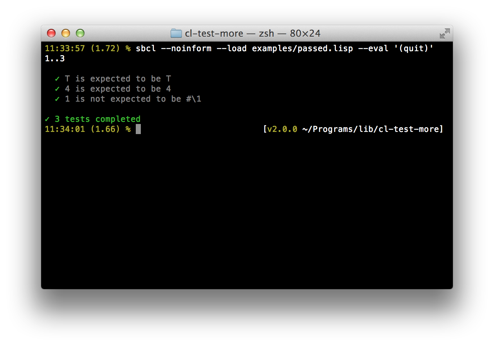
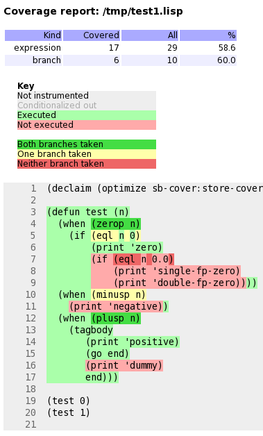
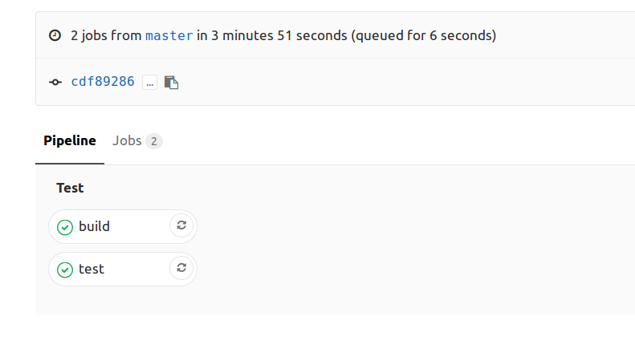

想要很简单就对写的代码进行测试？本章将介绍如何编写自动化测试并查看代码的覆盖率。同时也介绍了在现在的持续集成服务（如 Travis CI 和 Coveralls）中插入自己的测试。

我们将使用一个成熟且设计良好的回归测试框架，叫做 [Prove](https://github.com/fukamachi/prove)。Prove 不是唯一的测试框架，[FiveAM](http://quickdocs.org/fiveam/api)也很受欢迎（参见 [Turotial-Working-with-FiveAM]](http://turtleware.eu/posts/Tutorial-Working-with-FiveAM.html) 这篇博客），同时还有很多其他的[测试框架](https://github.com/CodyReichert/awesome-cl#unit-testing)。我们喜欢 `Prove` 是因为它的文档及其**可拓展报告**（prove 的报告风格非同一般，而且可以拓展）。

> warning: Prove has a couple limitations and will soon be obsolete. We advise to start with another test framework.

## 使用 Prove 进行测试

### 安装加载

`Prove` 在 quicklisp 中可以找到:

~~~lisp
(ql:quickload :prove)
~~~

上面这条命令将会安装并加载 `prove`。

### 编写测试文件

~~~lisp
(in-package :cl-user)
(defpackage my-test
  (:use :cl
        :prove))
(in-package :my-test)

(subtest "Showing off Prove"
  (ok (not (find 4 '(1 2 3))))
  (is 4 4)
  (isnt 1 #\1))

~~~

Prove 的 API 包括下列测试函数： `ok`，`is`，`isnt`，`is-values`，`is-type`，`like`（检查正则表达式）, `is-print`（检查是否是标准输出），`is-error`，`is-expand`，`pass`，`fail`，`skip`，`subtest`

### 运行测试文件

~~~lisp
(prove:run #P"myapp/tests/my-test.lisp")
(prove:run #P"myapp/tests/my-test.lisp" :reporter :list)
~~~

将会得到以下的结果:

### 运行一个测试

可以直接通过将测试文件编译来运行测试。在 Slime 中，通常是 `C-c C-c` 快捷键。

### 更多

`Prove` 还可以：

* 在 **Travis CI** 上运行，
* 修改输出的**颜色**，
* 报告**测试时间**，
* 修改默认测试函数，
* 设置阈值来减缓测试的运行，
* 一旦遇到异常，调出 **CL debugger**
* 与 **ASDF** 集成，因此可以在 REPL 中执行 `(asdf:test-system)` 或 `(prove:run)`（由同一个作者提供的 [cl-project](https://github.com/fukamachi/cl-project)有相应的配置）

更多参见 [Prove's documentation](https://github.com/fukamachi/prove)!

## 交互式修复测试单元

Common Lisp 天然就是可交互的（所以才会有很多的解释器），并且测试框架也可以使用这个特性。这样的话，在测试失败是测试框架可以打开调试器（debugger），这样就可以检查堆栈追踪并能立即跳转到出错的那一行，对其进行修复，然后通过 *restart* 从之前出错的地方重新运行测试。

在 Prove 中，将 `prove:*debug-on-error*` 设为 `t`。

下面简短的视频展示了所有的一系列操作（使用的是 FiveAM）：

<iframe width="560" height="315" sandbox="allow-same-origin allow-scripts" src="https://peertube.video/videos/embed/c0c82209-feaa-444d-962f-afa25745bfc0" frameborder="0" allowfullscreen></iframe>

注意，在 Debugger 中的操作如下:

- `<enter>` 展示更多的追踪（backtrace）信息
- `v` 在追踪信息中跳转的相对应的行或函数
- 更多选项可以查看菜单

## 代码覆盖率

代码覆盖率工具会输出个图形界面，通过这个界面可以知道代码哪部分被测试了，哪部分没有被测试：

### Generating an html test coverage output

SBCL comes with a built-in module to do code coverage analysis:
[sb-cover](http://www.sbcl.org/manual/index.html#sb_002dcover).

Coverage reports are only generated for code compiled using
`compile-file` with the value of the `sb-cover:store-coverage-data`
optimization quality set to 3.

~~~lisp
;;; Load SB-COVER
(require :sb-cover)

;;; Turn on generation of code coverage instrumentation in the compiler
(declaim (optimize sb-cover:store-coverage-data))

;;; Load some code, ensuring that it's recompiled with the new optimization
;;; policy.
(asdf:oos 'asdf:load-op :cl-ppcre-test :force t)

;;; Run the test suite.
(prove:run :yoursystem-test)
~~~

Produce a coverage report, set the output directory:

~~~lisp
(sb-cover:report "coverage/")
~~~

Finally, turn off instrumentation:

~~~lisp
(declaim (optimize (sb-cover:store-coverage-data 0)))
~~~

You can open your browser at
`../yourproject/t/coverage/cover-index.html` to see the report like
the capture above or like
[this code coverage of cl-ppcre](https://www.snellman.net/sbcl/cover/cl-ppcre-report-3/cover-index.html).

## 持续集成（continuous integration）

### Travis CI 和 Coveralls

[Travis](https://travis-ci.org/) 是在云端运行测试单元的服务，而 [Coveralls](https://coveralls.io/) 展示的是覆盖范围随时间的演变，同时也会展示 pull 请求将对覆盖范围缠身什么影响。

多亏了 `cl-travis`，我们可以轻松的在一个或多个解释器（ABCL、Allegro CL，SBCL、CMUCL、CCL以及ECL）进行测试。`cl-coveralls` 用来将输出的报告发不到服务上。`cl-coveralls` 支持在 SBCL 和Clozure CL 使用 Travis CI 和 Circle CI。

推荐阅读 [lisp-lang.org 上关于“持续集成”]](http://lisp-lang.org/learn/continuous-integration) 的详细说明。

在上述的链接中可以找到很多使用持续集成的例子，但如果只是想快速了解 Travis CI 和 Coveralls 的话，可以阅读：

- Lucerne 的 [Coveralls](https://coveralls.io/github/eudoxia0/lucerne) 和 [Travis](https://travis-ci.org/eudoxia0/lucerne) 的文章。

### Gitlab CI

[Gitlab CI](https://docs.gitlab.com/ce/ci/README.html) 是 Gitlab 的一部分，而且也能在 [Gitlab.com](https://gitlab.com) 上使用，不管是共有库还是私有库。直接来看个简单的 `.gitlab-ci.yml` 吧：

~~~
image: daewok/lisp-devel

before_script:
  - apt-get update -qy
  - apt-get install -y git-core
  - git clone https://github.com/foo/bar ~/quicklisp/local-projects/

test:
  script:
    - make test
~~~

Gitlab CI 是基于 Docker 的。通过 `image` 来告诉 Gitlab CI 使用 [daewok/lisp-devel](https://hub.docker.com/r/daewok/lisp-devel/) 镜像。这个镜像包含了 SBCL、ECL、CCL和BCL，同时也将 Quicklisp 安装在 home 目录下（`/home/lisp/`)，因此可以直接使用 `quickload`。如果有兴趣的话，还有个更简单的选择。Gitlab 将加载镜像，克隆项目然后以管理员的权限进入到项目根目录下，之后在运行其他的命令。

`test` 是自定义的一个“任务”，`script` 关键词可以接受命令列表然后执行列表中的命令。

假设需要在运行测试前安装依赖库，`before_scipt` 会在任务开始前运行。在这，我们克隆一个 Quicklisp 中的一个库，要这么做的话首先的安装 git（Docker 镜像都很简单）。

可以定位自己所在的目录。如果已经安装了 [Docker](https://docs.docker.com/) 并启动了 docker 的后台（`sudo service docker start`），可以运行下面的命令：

~~~sh
    docker run --rm -it -v /path/to/local/code:/usr/local/share/common-lisp/source daewok/lisp-devel:latest bash
~~~

上面的命令会下载 Lisp 镜像（400Mb左右），将本地额代码挂在到镜像中的指定位置，同时切换到 lisp 这个容器的 bash 中，之后就可以试试 `make test` 了。

以下 Dockerfile 完整的示例：

~~~
image: daewok/lisp-devel

stages:
  - test
  - build

before_script:
  - apt-get update -qy
  - apt-get install -y git-core
  - git clone https://github.com/foo/bar ~/quicklisp/local-projects/

test:
  stage: test
  script:
    - make test

build:
  stage: build
  only:
    - tags
  script:
    - make build
  artifacts:
    paths:
      - some-file-name
~~~

在上面的 Dockerfile 中，定义了两个 `步骤（stages）`（参考[环境](https://docs.gitlab.com/ce/ci/environments.html)）：“test” 和 “build”，这两个步骤是一个接一个运行的。"build" 步骤只有在 "test" 步骤执行成功之后才会执行。

”build“ 只在推送新标签时才会运行，而不是每提交一次就运行一次。当 build 成功后，`artifacts` 中的 `paths` 中列出的文件就可以下载。可以从 Gitlab 的 Pipelines UI 或是一个 url 下在这些文件。这个操作只会下载最近一次 build 任务生成的文件：

    https://gitlab.com/username/project-name/-/jobs/artifacts/master/raw/some-file-name?job=build

当管道穿过去之后，将会看到：

现在你已经可以使用 Gitlab CI 了。
